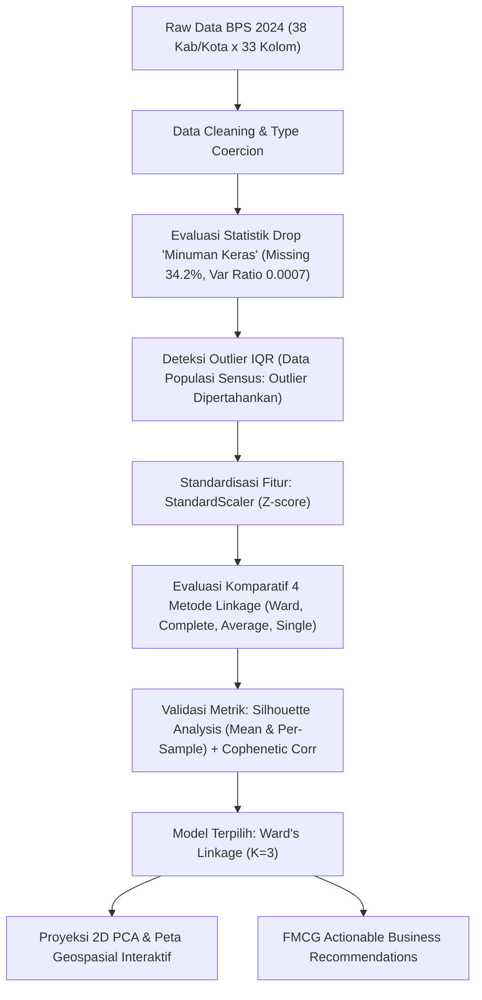

# 🍜 Analisis Klaster Pola Pengeluaran Makanan & Minuman Jadi — Jawa Timur 2024

> **Segmentasi 38 Kabupaten/Kota di Provinsi Jawa Timur Berdasarkan Pola Belanja Makanan & Minuman Jadi Menggunakan *Agglomerative Hierarchical Clustering***  
> **Framing Industri:** **FMCG & Consumer Analytics** (*Regional Distribution Strategy, Packaging Sizing, & Commercial Pricing*)

[](https://www.python.org/)
[](https://streamlit.io/)
[](https://scikit-learn.org/)
[](LICENSE)

**🌐 Live Dashboard:** [https://jatim-fnb-clustering.streamlit.app/](https://jatim-fnb-clustering.streamlit.app/)

---

## 📌 Executive Summary & Problem Framing

Dalam industri **Fast-Moving Consumer Goods (FMCG)** dan **On-Demand Food Services** (seperti Unilever Indonesia, Indofood, Wings Group, GoFood, dan GrabFood), keberhasilan strategi komersial sangat ditentukan oleh pemahaman mendalam terhadap variasi daya beli lokal (*local purchasing power*) dan kebiasaan belanja regional.

Menganggap Provinsi Jawa Timur sebagai satu pasar homogen adalah kekeliruan fatal:
- Karakter konsumsi metropolitan seperti **Kota Surabaya** dan **Kota Malang** sangat berbeda dengan kabupaten agraris tapal kuda seperti **Sampang** atau **Bondowoso**.
- Proyek ini menyajikan sistem segmentasi data-driven berbasis **38 Kabupaten/Kota** menggunakan data resmi **Badan Pusat Statistik (BPS) Jawa Timur 2024** guna memberikan rekomendasi bauran produk, rantai pasok, dan diferensiasi harga regional.

---

## 🎯 Key Findings & Strategic Insights

| Segmen Klaster | Jumlah Wilayah | Karakteristik Utama | Top Komoditas Dominan | Strategi FMCG / Bisnis |
|---|:---:|---|---|---|
| **🏙️ Urban High-Spender** | 2-4 Wilayah | Kota Metropolitan utama (Surabaya, Malang, Sidoarjo). Daya beli tertinggi, mobilitas cepat, preferensi tinggi terhadap kepraktisan. | Nasi campur/rames, Mie bakso, Daging/ayam matang, Minuman siap saji (kopi susu & teh). | Penetrasi produk *Ready-to-Drink (RTD)* premium, frozen food siap masak, kemasan multipack di *Modern Trade*. |
| **🏘️ Suburban Moderate** | 12-16 Wilayah | Koridor industri & sentra pertumbuhan (Gresik, Pasuruan, Mojokerto, Madiun). Basis pekerja industri & keluarga muda. | Makanan pokok olahan terjangkau, lauk olahan harian, mie instan. | Paket hemat "Family Pack", bumbu instan praktis, penguatan distribusi di minimarket dan warung sentral. |
| **🌾 Rural Conservative** | 18-22 Wilayah | Wilayah agraris, maritim, dan pedesaan. Belanja berorientasi hemat dan esensial; porsi memasak mandiri lebih tinggi. | Gorengan tradisional, jajanan pasar, mie instan sesekali. | Format kemasan sachet ekonomis (Rp 1.000 - Rp 2.500) dengan distribusi penetrasi intensif ke warung kelontong tradisional (*General Trade*). |

### 📈 Temuan Kesenjangan Konsumsi (Disparity Gap):
- **Bubur ayam** memiliki disparitas tertinggi mencapai **4.30x lipat** antara klaster perkotaan dan perdesaan.
- **Air kemasan galon** menunjukkan disparitas belanja **3.70x lipat**, menandakan penetrasi infrastruktur air minum siap konsumsi di kawasan urban jauh lebih mapan.
- **Roti tawar** mencatat kesenjangan **3.67x lipat**, mempertegas pergeseran sarapan berbasis roti di kota besar vs karbohidrat tradisional di pedesaan.

---

## 🔬 Metodologi & Transparansi Sains Data

Proyek ini menerapkan standar metodologis ketat untuk menjamin validitas statistik:



### 1. Justifikasi Kuantitatif Penghapusan Fitur `Minuman keras`
- **Missing Rate:** 34.2% (13 dari 38 wilayah tidak memiliki konsumsi / bernilai `-`).
- **Varians Fitur:** Hanya `661.4` berbanding rerata varians fitur lainnya yang mencapai ratusan ribu (rasio varians `< 0.001`).
- **Korelasi:** Korelasi rata-rata dengan kelompok makanan lain mendekati nol (`r = 0.07`).
- **Kesimpulan:** Menghapus fitur ini mencegah penambahan dimensi dengan informasi mendekati konstan yang dapat mendistorsi jarak Euclidean.

### 2. Rationale Penanganan Outlier (Perspektif Data Sensus Populasi)
- Deteksi metode IQR ($Q_1 - 1.5 \times IQR$ hingga $Q_3 + 1.5 \times IQR$) mendeteksi pencilan tinggi pada 21 fitur, khususnya di Kota Surabaya dan Kota Malang.
- **Keputusan Metodologis:** Karena dataset mencakup **seluruh 38 Kabupaten/Kota di Jawa Timur (populasi lengkap)**, nilai ekstrem ini bukan *error input* melainkan cerminan disparitas sosio-ekonomi nyata. Seluruh nilai dipertahankan agar segmen bernilai tinggi (*high-spend urban*) teridentifikasi secara presisi.

### 3. Komparasi 4 Metode Linkage & Validasi Metrik
Kami mengevaluasi 4 metode linkage pada rentang $K \in [2, 10]$:
- **Ward's Method:** Dipilih karena meminimalkan varians internal klaster, menghasilkan pengelompokan yang paling seimbang dan dapat dioperasionalkan secara manajerial.
- **Cophenetic Correlation Coefficient:**
  - Single: `0.8115`
  - Average: `0.7944`
  - Complete: `0.7592`
  - Ward: `0.6379`
- **Silhouette Analysis:** Evaluasi per-sampel menunjukkan seluruh klaster memiliki koefisien positif dengan pemisahan margin yang jelas.

---

## 💼 Business Impact & Use Cases

### 1. 🛒 FMCG & Retail Strategy
- **Portofolio Kemasan:** Kemasan sachet ekonomis difokuskan untuk Klaster *Rural Conservative*, sementara varian premium dan multipack difokuskan pada *Urban High-Spender*.
- **Alokasi Jalur Distribusi:** *Modern Trade* (Indomaret, Alfamart, Supermarket) sebagai tulang punggung Klaster Urban; *General Trade* (grosir pasar induk dan warung kelontong) di Klaster Rural.

### 2. 🍔 Food Delivery & Quick-Service Restaurant (QSR)
- **Ekspansi Merchant:** Prioritas penambahan mitra restoran kuliner premium dan layanan pesan-antar instan di klaster *Urban High-Spender*.
- **Promosi Komuter:** Kampanye paket makan siang kantor dan sarapan praktis untuk komuter di klaster *Suburban Moderate*.

### 3. 🏛️ Pemerintah Daerah & Dinas Kesehatan
- **Ketahanan Pangan:** Monitoring disparitas konsumsi protein hewani siap santap untuk memetakan risiko gizi buruk dan stunting.
- **Sanitasi Pangan:** Edukasi higienitas pedagang kaki lima di sentra-sentra konsumsi tinggi.

---

## 📁 Struktur Repositori

```
Proyek Akhir/
├── README.md                          # Dokumentasi komprehensif proyek
├── requirements.txt                   # Dependensi Python
├── .gitignore                         # Konfigurasi pengabaian file Git
├── app.py                             # Aplikasi dashboard Streamlit interaktif
├── src/                               # Modul kode sumber modular
│   ├── __init__.py                    # Inisialisasi package
│   ├── data_loader.py                 # Pemuatan dan pembersihan data BPS
│   ├── preprocessing.py               # Evaluasi drop fitur, deteksi outlier IQR, scaling, seleksi fitur
│   ├── clustering.py                  # Hierarchical clustering, kofenet, siluet, gap analysis, rekomendasi bisnis
│   └── visualization.py              # Visualisasi statis (Matplotlib) & interaktif (Plotly & Geospasial)
├── data/
│   ├── raw/
│   │   └── pengeluaran_jatim_2024.xlsx # Data mentah BPS Jawa Timur 2024
│   └── processed/
│       └── .gitkeep                   # Folder penyimpanan hasil ekspor data
├── notebooks/
│   └── 01_eda_and_clustering.ipynb    # Jupyter Notebook eksplorasi dan pemodelan reproducible
├── reports/
│   └── laporan_proyek_akhir.pdf       # Laporan akademik lengkap proyek
├── scripts/
│   └── build_notebook.py              # Script utilitas pembuatan notebook
└── assets/
    └── screenshots/                   # Tangkapan layar antarmuka dashboard
```

---

## 🚀 Panduan Menjalankan Proyek (Quick Start)

### 1. Clone & Masuk ke Repositori
```bash
git clone <url-repo-anda>
cd "Proyek Akhir"
```

### 2. Pasang Dependensi
Disarankan menggunakan virtual environment:
```bash
python -m venv .venv
# Di Windows:
.venv\Scripts\activate
# Di Linux/macOS:
source .venv/bin/activate

pip install -r requirements.txt
```

### 3. Jalankan Aplikasi Dashboard Streamlit
```bash
streamlit run app.py
```
Aplikasi interaktif akan terbuka di browser Anda pada alamat `http://localhost:8501`.

### 4. Menjalankan Jupyter Notebook
```bash
jupyter notebook notebooks/01_eda_and_clustering.ipynb
```

---

## 📊 Antarmuka Dashboard Interaktif

Dashboard Streamlit dilengkapi dengan fitur-fitur unggulan:
- **🎛️ Dynamic Controls:** Pilihan 4 metode linkage (*Ward, Complete, Average, Single*) dan slider jumlah klaster ($K=2-10$) secara *real-time*.
- **🗺️ Interactive Map:** Peta geospasial interaktif 38 Kabupaten/Kota Jawa Timur dengan titik koordinat presisi.
- **📉 Per-Sample Silhouette Analysis:** Visualisasi ketebalan pita siluet per klaster untuk mendeteksi wilayah *borderline*.
- **📊 Interactive Plotly Charts:** Proyeksi 2D PCA dengan *hover tooltip* informasi pengeluaran mingguan, bar chart kesenjangan rasio, dan heatmap median.
- **📥 CSV Export:** Kemampuan mengunduh hasil segmentasi dan label bisnis secara langsung.

---

## 📜 Lisensi & Konteks Akademik

Proyek ini dikembangkan sebagai bagian dari Ujian / Proyek Akhir Mata Kuliah **Pemodelan Statistik Terapan** (Semester 2).

Lisensi: [MIT](LICENSE). Terbuka untuk eksplorasi akademik dan pengembangan portofolio data science industri.
