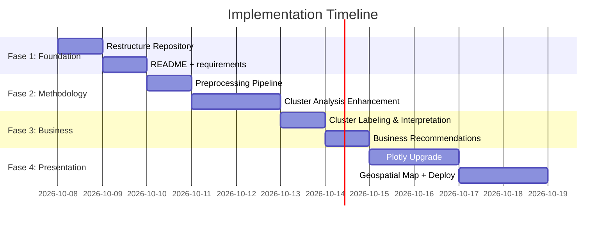

# 🗺️ Implementation Plan: Optimasi Proyek Klaster Pengeluaran Jawa Timur

> **Tujuan:** Meningkatkan skor evaluasi dari **4.7/10 → 8+/10** di keempat dimensi
> **Target Framing Industri:** **FMCG & Consumer Analytics** — paling bernilai untuk karir data science karena relevansi domain (Unilever, Indofood, GoTo/GrabFood, Nielsen, Kantar)
> **Estimasi Total:** 8-12 hari kerja (part-time)

---

## 📋 Kondisi Notebook Saat Ini (Yang Sudah Diidentifikasi)

Setelah membaca **24 cells** di [hierarclust_project_script.ipynb](file:///d:/ARFI/Kuliah/Semester%202/Pemodelan%20Statistik%20Terapan/Proyek%20Akhir/hierarclust_project_script.ipynb), berikut pemetaan metodologi yang sudah ada:

| Cell | Isi | Status |
|------|-----|--------|
| 0 | Import libraries | ✅ Standard |
| 1-3 | Load data, `head()`, `info()` | ✅ Basic |
| 4-7 | Handle missing values ("Minuman keras": `-` → NaN → mean impute → drop) | ⚠️ Kontradiktif |
| 8 | Pisahkan label & fitur | ✅ OK |
| 9 | Boxplot + Heatmap korelasi sebelum scaling | ✅ Basic EDA |
| 10 | Drop "Minuman keras", StandardScaler, boxplot setelah scaling | ⚠️ Justifikasi kurang |
| 11 | **Dendrogram 4 metode** (single, complete, average, ward) | ✅ Sudah ada! |
| 12 | Silhouette Score (ward only, K=2-10) | ✅ OK |
| 13 | **Silhouette Score 4 metode** (ward, complete, average, single) + best method annotation | ✅ Sudah ada! |
| 14 | Final model: Ward, K=3 | ✅ OK |
| 15-21 | Distribusi, profil, heatmap, top features, boxplot per klaster | ✅ Standard |
| 22 | PCA 2D visualization | ✅ Standard |
| 23 | Save (commented out) | ⚠️ Tidak aktif |

> [!IMPORTANT]
> **Temuan kunci:** Notebook **sudah membandingkan 4 metode linkage** (Cell 11 & 13), tapi Streamlit app **hanya menampilkan Ward**. Ini adalah gap presentasi, bukan gap metodologi. Evaluasi awal saya perlu dikoreksi pada poin ini.

### Gap yang Masih Valid

| Gap | Detail |
|-----|--------|
| Preprocessing | Imputasi mean → drop tanpa justifikasi statistik; tidak ada outlier handling; tidak ada feature selection data-driven |
| Validation | Tidak ada silhouette plot per sampel; tidak ada cophenetic correlation; tidak ada cluster stability test |
| Interpretation | Label klaster generik ("Klaster 0, 1, 2"); tidak ada actionable business recommendation |
| Engineering | Monolitik, no README, no reproducibility setup |

---

## 🏗️ Fase 1: Foundation & Code Quality (1-2 Hari)

**Target Skor: Code Quality 4/10 → 7/10**

### Task 1.1: Restructure Repository
**Estimasi:** 2-3 jam

Buat struktur folder profesional:

```
food-expenditure-clustering-jatim/
├── README.md                          # [NEW]
├── requirements.txt                   # [NEW]
├── .gitignore                         # [NEW]
├── app.py                             # [REFACTOR dari hierarclust_app.py]
├── src/
│   ├── __init__.py
│   ├── data_loader.py                 # Fungsi load & clean data
│   ├── preprocessing.py               # Scaling, feature selection logic
│   ├── clustering.py                  # Model fitting, evaluation metrics
│   └── visualization.py              # Semua fungsi plotting
├── data/
│   └── raw/
│       └── pengeluaran_jatim_2024.xlsx  # Rename ke nama pendek
├── notebooks/
│   └── 01_eda_and_clustering.ipynb    # [REFACTOR dari notebook saat ini]
├── reports/
│   └── laporan_proyek_akhir.pdf
└── assets/
    └── screenshots/                   # Screenshot dashboard untuk README
```

**Detail implementasi:**
- Ekstrak fungsi dari `hierarclust_app.py` ke module terpisah di `src/`
- `data_loader.py`: `load_raw_data()`, `clean_data()`, `get_numeric_features()`
- `preprocessing.py`: `handle_missing_values()`, `detect_outliers()`, `scale_features()`, `select_features()`
- `clustering.py`: `compare_linkage_methods()`, `fit_cluster()`, `evaluate_silhouette()`, `get_cluster_profiles()`
- `visualization.py`: `plot_dendrogram()`, `plot_silhouette()`, `plot_pca()`, `plot_heatmap()`, `plot_cluster_distribution()`
- Setiap fungsi harus memiliki **docstring** dan **type hints**

### Task 1.2: Buat requirements.txt
**Estimasi:** 15 menit

```
pandas>=2.0.0
numpy>=1.24.0
scikit-learn>=1.3.0
scipy>=1.11.0
matplotlib>=3.7.0
seaborn>=0.12.0
streamlit>=1.28.0
openpyxl>=3.1.0
plotly>=5.15.0          # NEW - untuk interaktif charts
folium>=0.14.0          # NEW - untuk peta geospasial
streamlit-folium>=0.15  # NEW - folium integration
```

### Task 1.3: Buat .gitignore
**Estimasi:** 5 menit

Standard Python `.gitignore` + custom entries untuk `__pycache__/`, `.ipynb_checkpoints/`, `data/processed/`

### Task 1.4: Buat README.md Profesional
**Estimasi:** 3-4 jam

**Struktur README yang direkomendasikan:**

```markdown
# 🍜 Analisis Klaster Pola Pengeluaran Makanan & Minuman Jadi — Jawa Timur 2024

> Segmentasi 38 Kabupaten/Kota Jawa Timur berdasarkan pola konsumsi
> makanan dan minuman jadi menggunakan Hierarchical Clustering


[screenshot dashboard di sini]

## 🎯 Key Findings
- 3 segmen utama teridentifikasi: ...
- Kota Surabaya, Sidoarjo, Gresik membentuk klaster "High-Spend Urban"
- Gap pengeluaran antara urban-rural mencapai Xkali untuk kategori ...

## 💼 Business Value
Hasil segmentasi ini dapat digunakan oleh:
- **FMCG companies** untuk regional pricing & product distribution strategy
- **Food delivery platforms** untuk market penetration prioritization
- **Pemerintah daerah** untuk kebijakan ketahanan pangan

## 🚀 Quick Start
...

## 📊 Methodology
...

## 📁 Project Structure
...
```

---

## 🔬 Fase 2: Data Science Methodology Enhancement (2-3 Hari)

**Target Skor: DS Methodology 5/10 → 8/10**

### Task 2.1: Perkuat Preprocessing Pipeline
**Estimasi:** 4-5 jam

#### 2.1a. Dokumentasi Keputusan Drop "Minuman Keras"
Saat ini: drop dengan alasan informal. Yang perlu dilakukan:

```python
# Analisis kuantitatif untuk justifikasi drop
# 1. Variance analysis
print(f"Variance 'Minuman keras': {data['Minuman keras'].var():.2f}")
print(f"Mean variance semua fitur: {data.var().mean():.2f}")

# 2. Missing rate
missing_rate = (data['Minuman keras'] == '-').sum() / len(data)
print(f"Missing rate: {missing_rate:.1%}")

# 3. Correlation dengan fitur lain
print(data.corrwith(data['Minuman keras']).describe())
```

Hasil ini harus **ditampilkan di notebook dan dashboard** sebagai justifikasi.

#### 2.1b. Outlier Detection & Handling
Tambahkan analisis outlier menggunakan IQR method:

```python
def detect_outliers_iqr(df, features):
    """Detect outliers using IQR method for each feature."""
    outlier_summary = {}
    for col in features:
        Q1 = df[col].quantile(0.25)
        Q3 = df[col].quantile(0.75)
        IQR = Q3 - Q1
        lower = Q1 - 1.5 * IQR
        upper = Q3 + 1.5 * IQR
        outliers = df[(df[col] < lower) | (df[col] > upper)]
        outlier_summary[col] = {
            'count': len(outliers),
            'percentage': len(outliers) / len(df) * 100,
            'regions': outliers.index.tolist()
        }
    return outlier_summary
```

**Keputusan yang perlu dibuat:** Apakah outlier di-keep (karena ini data populasi, bukan sampel — setiap kab/kota adalah observasi valid) atau di-handle. **Justifikasi keputusan ini harus tertulis.**

> [!NOTE]
> Karena dataset ini adalah **data populasi** (38 kab/kota Jawa Timur = seluruh populasi), outlier sebenarnya adalah **pola legitimate** yang mencerminkan perbedaan kota besar vs kabupaten. Rekomendasi: **keep outlier, dokumentasikan alasannya**.

#### 2.1c. Feature Selection yang Data-Driven
Tambahkan analisis untuk memperkuat keputusan feature selection:

```python
# 1. Variance Threshold — fitur dengan variance sangat rendah
from sklearn.feature_selection import VarianceThreshold
selector = VarianceThreshold(threshold=0.1)

# 2. Correlation-based — drop fitur dengan korelasi > 0.9
high_corr_pairs = []
corr_matrix = data_numerik.corr().abs()
for i in range(len(corr_matrix.columns)):
    for j in range(i):
        if corr_matrix.iloc[i, j] > 0.9:
            high_corr_pairs.append((corr_matrix.columns[i], 
                                     corr_matrix.columns[j],
                                     corr_matrix.iloc[i, j]))

# 3. PCA Loadings — fitur mana yang paling berkontribusi
pca_full = PCA()
pca_full.fit(df_scaled)
loadings = pd.DataFrame(pca_full.components_.T, 
                         columns=[f'PC{i+1}' for i in range(len(pca_full.components_))],
                         index=data_numerik.columns)
```

### Task 2.2: Perkuat Analisis Klaster
**Estimasi:** 4-5 jam

#### 2.2a. Transfer Perbandingan Metode dari Notebook ke Dashboard
Notebook **sudah memiliki** perbandingan 4 metode di Cell 11 & 13. Integrasikan ini ke Streamlit app:

```python
# Di tab "Penentuan Jumlah Klaster", tambahkan:
# - Dropdown untuk pilih metode linkage
# - Plot overlay silhouette scores semua metode (seperti Cell 13)
# - Tabel ringkasan: metode | best K | best silhouette score
# - Cophenetic correlation coefficient per metode
```

#### 2.2b. Tambahkan Silhouette Plot Per Sampel
Ini menunjukkan seberapa "confident" setiap observasi masuk ke klasternya:

```python
from sklearn.metrics import silhouette_samples
import matplotlib.cm as cm

def plot_silhouette_analysis(X, labels, n_clusters):
    """Plot silhouette analysis showing per-sample scores."""
    sample_silhouette_values = silhouette_samples(X, labels)
    avg_score = silhouette_score(X, labels)
    
    fig, ax = plt.subplots(figsize=(10, 6))
    y_lower = 10
    
    for i in range(n_clusters):
        ith_cluster = sample_silhouette_values[labels == i]
        ith_cluster.sort()
        size_cluster = ith_cluster.shape[0]
        y_upper = y_lower + size_cluster
        
        color = cm.nipy_spectral(float(i) / n_clusters)
        ax.fill_betweenx(np.arange(y_lower, y_upper), 0, ith_cluster,
                          facecolor=color, edgecolor=color, alpha=0.7)
        ax.text(-0.05, y_lower + 0.5 * size_cluster, str(i))
        y_lower = y_upper + 10
    
    ax.axvline(x=avg_score, color="red", linestyle="--", 
               label=f"Average: {avg_score:.3f}")
    ax.set_xlabel("Silhouette Coefficient")
    ax.set_ylabel("Cluster")
    ax.legend()
    return fig
```

**Value:** Menunjukkan wilayah mana yang "borderline" antara dua klaster — ini insight yang sangat berharga untuk bisnis.

#### 2.2c. Tambahkan Cophenetic Correlation Coefficient
Mengukur seberapa baik dendrogram merepresentasikan jarak asli:

```python
from scipy.cluster.hierarchy import cophenet
from scipy.spatial.distance import pdist

for method in ['ward', 'complete', 'average', 'single']:
    Z = linkage(df_scaled, method=method)
    c, _ = cophenet(Z, pdist(df_scaled))
    print(f"{method}: cophenetic correlation = {c:.4f}")
```

#### 2.2d. Tambahkan Tabel Ringkasan Evaluasi Komprehensif
Di dashboard, tampilkan tabel:

| Metode | Best K | Silhouette Score | Cophenetic Corr | Status |
|--------|--------|------------------|-----------------|--------|
| Ward | 3 | 0.XXX | 0.XXX | ✅ Dipilih |
| Complete | X | 0.XXX | 0.XXX | |
| Average | X | 0.XXX | 0.XXX | |
| Single | X | 0.XXX | 0.XXX | |

---

## 💼 Fase 3: Business Context & Impact (1-2 Hari)

**Target Skor: Business Context 4/10 → 8/10**

### Task 3.1: Beri Label Bisnis pada Setiap Klaster
**Estimasi:** 2-3 jam

Ganti "Klaster 0, 1, 2" dengan label deskriptif berdasarkan profil median. Contoh naming convention:

```python
# Berdasarkan analisis profil median di notebook Cell 16-18
# (label final tergantung hasil aktual, ini template)
cluster_business_labels = {
    0: "🏙️ Urban High-Spender (Kota Besar)",
    1: "🏘️ Suburban Moderate (Kota Menengah)", 
    2: "🌾 Rural Conservative (Kabupaten)"
}

# Karakterisasi per klaster
cluster_characteristics = {
    0: {
        "description": "Wilayah kota besar dengan pengeluaran makanan jadi tertinggi. "
                       "Dominan di kategori nasi campur/rames, mie bakso, dan minuman jadi.",
        "typical_regions": ["Kota Surabaya", "Kota Malang", "..."],
        "business_implication": "Target utama untuk ekspansi food delivery dan restoran premium."
    },
    # ... dst
}
```

### Task 3.2: Tambahkan Section "Business Recommendations" di Dashboard
**Estimasi:** 3-4 jam

Tambahkan tab atau section baru di dashboard dengan konten:

**Untuk setiap klaster, jawab:**
1. **Who** — Karakteristik demografis/geografis wilayah di klaster ini
2. **What** — Pola pengeluaran dominan (top 5 kategori yang membedakan)
3. **So What** — Implikasi bisnis untuk stakeholder:
   - 🛒 **FMCG/Retail:** Strategi distribusi produk & regional pricing
   - 🍔 **Food Delivery:** Prioritas ekspansi pasar & jenis layanan
   - 🏛️ **Pemerintah:** Implikasi kebijakan ketahanan pangan & nutrisi
4. **Now What** — Rekomendasi aksi spesifik

### Task 3.3: Tambahkan Analisis Komparatif
**Estimasi:** 2-3 jam

```python
# Analisis gap antar klaster
gap_analysis = pd.DataFrame()
for feature in top_features:
    gap_analysis[feature] = {
        'Max Cluster': cluster_profile[feature].idxmax(),
        'Min Cluster': cluster_profile[feature].idxmin(),
        'Gap Ratio': cluster_profile[feature].max() / cluster_profile[feature].min(),
        'Gap Absolute': cluster_profile[feature].max() - cluster_profile[feature].min()
    }
```

Highlight fitur dengan gap terbesar — ini yang paling menarik bagi bisnis.

### Task 3.4: Framing FMCG / Consumer Analytics
**Estimasi:** 1 jam

Tambahkan konteks di README dan dashboard:

> "Analisis ini mensimulasikan workflow yang dilakukan oleh **Consumer Insights Analyst** di perusahaan FMCG seperti Unilever Indonesia atau Indofood. Segmentasi wilayah berdasarkan pola konsumsi digunakan untuk menentukan **regional distribution strategy**, **product portfolio optimization**, dan **targeted marketing campaigns**."

---

## 🎨 Fase 4: Presentation & Storytelling Polish (2-3 Hari)

**Target Skor: Presentation 6/10 → 9/10**

### Task 4.1: Upgrade Visualisasi Statis → Interaktif (Plotly)
**Estimasi:** 4-5 jam

Ganti matplotlib charts kunci dengan Plotly:

```python
import plotly.express as px
import plotly.graph_objects as go

# PCA Plot — hover menampilkan nama wilayah + klaster + top spending
fig = px.scatter(df_pca, x='PC1', y='PC2', color='Nama_Klaster',
                 hover_name='Kabupaten/Kota',
                 hover_data={'Top_Spending': True},
                 title=f'Peta Klaster PCA ({variance:.1f}% Varians)')
st.plotly_chart(fig, use_container_width=True)

# Bar chart — interaktif
fig = px.bar(cluster_profile[top_features].T, barmode='group',
             title="Perbandingan Pengeluaran per Klaster")
st.plotly_chart(fig, use_container_width=True)
```

**Charts yang diupgrade ke Plotly:**
- [x] PCA scatter plot (hover = nama wilayah)
- [x] Cluster distribution bar chart
- [x] Top features comparison
- [x] Heatmap profil klaster

**Charts yang tetap matplotlib** (karena Plotly kurang bagus untuk ini):
- [x] Dendrogram
- [x] Silhouette plot per sampel
- [x] Boxplot distribusi fitur

### Task 4.2: Tambahkan Geospatial Visualization (Peta Choropleth)
**Estimasi:** 4-5 jam

Ini adalah **wow factor** terbesar — recruiter akan langsung terkesan.

```python
import folium
from streamlit_folium import st_folium

# GeoJSON Jawa Timur (dari sumber terbuka)
# Setiap kab/kota diwarnai berdasarkan klaster

def create_cluster_map(df, geojson_data):
    m = folium.Map(location=[-7.5, 112.5], zoom_start=8)
    
    folium.Choropleth(
        geo_data=geojson_data,
        data=df,
        columns=['Kabupaten/Kota', 'Cluster'],
        key_on='feature.properties.name',
        fill_color='YlOrRd',
        legend_name='Klaster Pengeluaran'
    ).add_to(m)
    
    return m
```

**Sumber GeoJSON:** File GeoJSON kabupaten/kota Jawa Timur tersedia di repository terbuka (misalnya: github.com/superpikar/indonesia-geojson).

### Task 4.3: Perbaiki Styling Dashboard
**Estimasi:** 2-3 jam

- Tambahkan custom CSS untuk Streamlit (font, spacing, card styling)
- Gunakan `st.metric()` untuk menampilkan KPI utama (jumlah klaster, silhouette score, total wilayah)
- Tambahkan executive summary box di atas setiap tab
- Konsistenkan color palette di seluruh dashboard

```python
# Metrics row di atas dashboard
col1, col2, col3, col4 = st.columns(4)
col1.metric("Jumlah Klaster", n_clusters)
col2.metric("Silhouette Score", f"{sil_score:.3f}")
col3.metric("Total Wilayah", len(df))
col4.metric("Fitur Analisis", len(all_features))
```

### Task 4.4: Deploy ke Streamlit Cloud
**Estimasi:** 1 jam

1. Push ke GitHub (public repo)
2. Connect ke [share.streamlit.io](https://share.streamlit.io)
3. Tambahkan link live demo di README badge

---

## 📊 Proyeksi Skor Setelah Implementasi

| Dimensi | Sebelum | Setelah Fase 1 | Setelah Fase 2 | Setelah Fase 3 | Setelah Fase 4 |
|---|---|---|---|---|---|
| Code Quality | 4/10 | **7/10** | 7/10 | 7/10 | 7.5/10 |
| DS Methodology | 5/10 | 5/10 | **8/10** | 8/10 | 8/10 |
| Business Context | 4/10 | 4/10 | 4.5/10 | **8/10** | 8.5/10 |
| Presentation | 6/10 | 6/10 | 6.5/10 | 7/10 | **9/10** |
| **Overall** | **4.7** | **5.5** | **6.5** | **7.5** | **8.3** |

---

## ⏱️ Timeline Ringkasan



---

## ❓ Keputusan yang Perlu Diambil Sebelum Implementasi

1. **Bahasa utama di dashboard & README:** Tetap Bahasa Indonesia atau switch ke English? (English lebih universal untuk portofolio, tapi ini proyek kuliah berbahasa Indonesia)
2. **Apakah notebook juga perlu di-refactor?** Atau cukup app Streamlit saja yang dioptimasi?
3. **Mau mulai dari fase berapa?** Rekomendasi: mulai Fase 1 → 2 → 3 → 4 secara berurutan.
4. **Apakah ada constraint deadline** dari kuliah atau target mulai apply magang?
